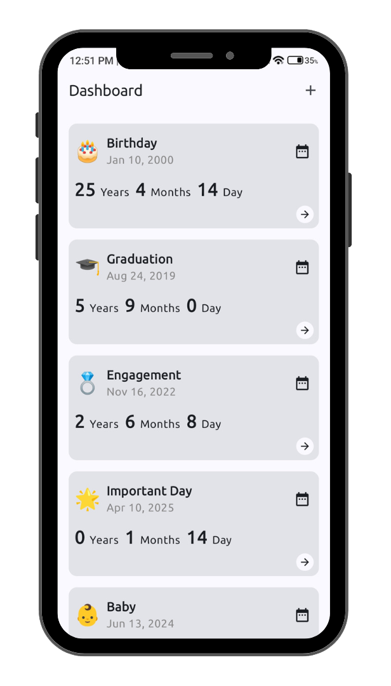

# 🧮 Age Calculator App

A beginner-friendly Android app to calculate age and track important occasions using **Jetpack Compose** and modern Android libraries. Built with a clean UI and Kotlin Multiplatform-ready tools.

## 🎥 Watch the Full Tutorial

📺 **YouTube Video:**  
  
👉 [Click here to watch on YouTube](https://www.youtube.com/watch?v=dj9ZMbot6zE)

## ✨ Features

- 📰 Add and manage multiple **occasions** like Birthdays, Anniversaries, Graduations 🎂🎓
- 🔄 Calculate **exact age** with a detailed breakdown: years, months, days, hours, minutes, and seconds
- 📖 Fully built using **Jetpack Compose** and **Material 3**
- 💾 Offline support with **Room Database**
- 📡 Clean architecture with **ViewModel** and **Koin DI**
- 📅 Uses **Kotlinx DateTime** for accurate time handling

---
# :camera_flash: **Screenshots**

| Dashboard Screen                  | Calculator Screen               |
|-----------------------------------|-----------------------------------|
|  |   |

## 🛠️ Built With

- **UI** - Jetpack Compose + Material 3
- **State & Logic** - ViewModel, State, remember
- **Local Storage** - Room Database
- **Time Handling** - Kotlinx DateTime
- **DI** - Koin

## 📄 License
This project is licensed under the MIT License.

---

# :memo: Author :memo:
- [Mohammad Arif](https://github.com/CodeInKotLang)

Check out my Udemy Courses: 
- 📚 [Android Quiz App: Ktor Backend & Jetpack Compose](https://www.udemy.com/course/quiztime/?referralCode=D1F5E08155303110B7A4)  
- 📚 [Android Fitness App: Firebase & Jetpack Compose](https://www.udemy.com/course/measuremate/?referralCode=B3DE352F96BC3C3E9E80)  
 

Happy learning and building amazing Android apps!
